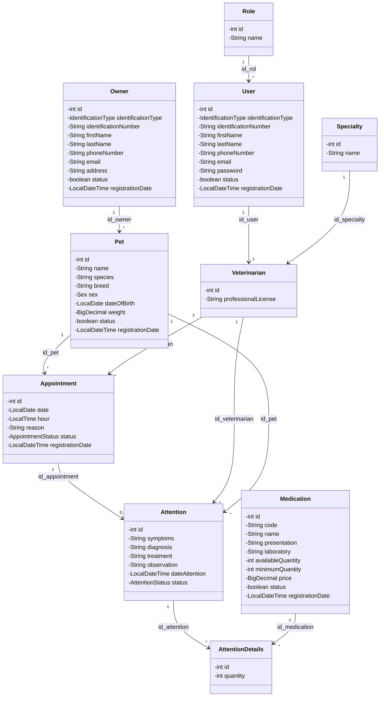
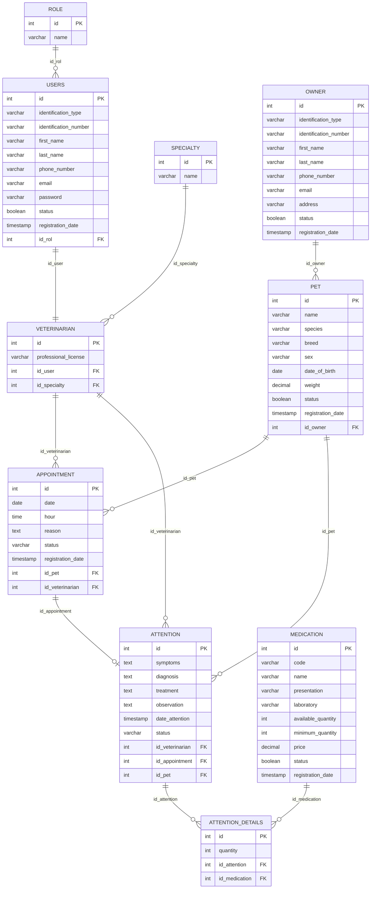

# VetCare

Sistema de gestión para una clínica veterinaria, desarrollado en Java SE con persistencia en PostgreSQL. Permite administrar propietarios, mascotas, veterinarios, especialidades, citas, atenciones médicas y el inventario de medicamentos, con control de acceso basado en roles.

## Descripción

VetCare es una aplicación de escritorio (interfaz gráfica con `JOptionPane`) que digitaliza el flujo operativo de una clínica veterinaria: desde el registro de propietarios y sus mascotas, la programación de citas con un veterinario, hasta la atención médica misma —incluyendo el consumo de medicamentos del inventario y el descuento automático de existencias—.

La aplicación distingue tres roles de usuario (`ADMIN`, `RECEPCIONISTA`, `VETERINARIO`), cada uno con acceso a un subconjunto distinto de funcionalidades según sus responsabilidades.

## Caso de uso

Flujo principal ("camino feliz") que cubre la aplicación:

1. **Login**: el usuario inicia sesión con correo y contraseña; el menú disponible se filtra según su rol.
2. **Registrar propietario**: se crea un `Owner` con sus datos de contacto.
3. **Registrar mascota**: se asocia una `Pet` a un propietario activo.
4. **Registrar especialidad** (ADMIN): se define una especialidad médica (ej. "Cirugía", "Dermatología").
5. **Registrar veterinario** (ADMIN): se vincula un `User` con rol `VETERINARIO` a una especialidad existente y una tarjeta profesional única.
6. **Agendar cita**: se programa una `Appointment` entre una mascota y un veterinario, validando que ambos estén activos, que no haya cruces de horario, y que la fecha no sea pasada.
7. **Confirmar cita**: la cita pasa de `PROGRAMADA` a `CONFIRMADA`.
8. **Iniciar atención**: solo permitido desde una cita `CONFIRMADA`; crea una `Attention` y mueve la cita a `EN_ATENCION`.
9. **Finalizar atención**: se registra diagnóstico, tratamiento/observación y los medicamentos utilizados. En una única transacción se actualiza la atención, se insertan los `AttentionDetails`, se descuenta el inventario de cada medicamento (validando existencias) y la cita pasa a `FINALIZADA`. Si algo falla, todo se revierte (rollback).
10. **Consultar historial médico**: se lista el historial de atenciones de una mascota.

## Tecnologías

| Tecnología | Uso |
|---|---|
| Java 21 (SE) | Lenguaje y plataforma |
| Maven | Gestión de dependencias y build |
| Swing (`JOptionPane`) | Interfaz gráfica |
| JDBC | Acceso a datos |
| PostgreSQL | Motor de base de datos |

Dependencia declarada en `pom.xml`: `org.postgresql:postgresql:42.7.13`.

## Estructura de paquetes

Arquitectura por capas: `model → dao (interfaces + impl) → service (interfaces + impl) → controller → view`.

```
com.vetcare
├── app          # Punto de entrada (App.java: main)
├── config       # ConnectionDB: configuración de la conexión JDBC
├── model        # Entidades del dominio (POJOs)
├── enums        # IdentificationType, Sex, AppointmentStatus, AttentionStatus
├── dao          # Interfaces de acceso a datos
│   └── impl     # Implementaciones JDBC de cada DAO
├── service      # Interfaces de lógica de negocio
│   └── impl     # Implementaciones de servicio (reglas de negocio, transacciones)
├── controller   # Orquestan vista <-> servicio, manejan excepciones
├── view         # Diálogos Swing/JOptionPane
└── exception    # Jerarquía de excepciones de la aplicación
```

**Jerarquía de excepciones:**

- `BusinessException` (extiende `RuntimeException`) — reglas de negocio violadas (ej. `InsufficientStockException`, `InvalidAppointmentStateException`, `DuplicateOwnerDocumentException`, `AppointmentConflictException`, etc.)
- `ValidationException` (extiende `RuntimeException`) — datos de entrada inválidos.
- `PersistenceException` (extiende `RuntimeException`) — errores de acceso a datos (envuelve `SQLException`).

Cada `Controller` diferencia estas tres categorías: `ValidationException`/`BusinessException` muestran el mensaje real al usuario, `PersistenceException` muestra un mensaje genérico (sin detalles técnicos de SQL), y cualquier otra `Exception` muestra un mensaje inesperado sin cerrar la aplicación.

## Diagrama de clases

Modelo de dominio (paquete `model`) y sus relaciones:



Cada entidad principal (`Owner`, `Pet`, `Veterinarian`, `Appointment`, `Attention`, `Medication`, `User`, `Specialty`, `Role`) tiene su propia interfaz `XxxDAO` + `XxxDAOImpl`, `XxxService` + `XxxServiceImpl`, `XxxController` y `XxxView`, siguiendo el mismo patrón capa por capa.

## Diagrama entidad-relación

Corresponde al esquema físico en PostgreSQL (`db.sql` / `SCRIPT VETCARE.sql`):



## Configuración de la base de datos

1. Crea la base de datos en PostgreSQL:
   ```sql
   CREATE DATABASE vetcare;
   ```
2. Ejecuta el script de creación de tablas ubicado en la raíz del proyecto: [`SCRIPT VETCARE.sql`](SCRIPT%20VETCARE.sql) (o su equivalente [`db.sql`](db.sql)).
3. Ajusta las credenciales de conexión en [`app/src/main/java/com/vetcare/config/ConnectionDB.java`](app/src/main/java/com/vetcare/config/ConnectionDB.java) si son distintas a las siguientes por defecto:

   ```java
   URL  = "jdbc:postgresql://localhost:5432/vetcare"
   USER = "postgres"
   PASS = "123456"
   ```
4. Siembra al menos los tres roles base (si el script no los incluye ya):
   ```sql
   INSERT INTO role (name) VALUES ('ADMIN'), ('RECEPCIONISTA'), ('VETERINARIO');
   ```
5. Crea un usuario inicial con rol `ADMIN` para poder iniciar sesión la primera vez (las contraseñas se almacenan en texto plano, tal como están definidas en el esquema actual):
   ```sql
   INSERT INTO users (identification_type, identification_number, first_name, last_name,
       phone_number, email, password, id_rol)
   VALUES ('CC', '0000000000', 'Admin', 'VetCare', '3000000000',
       'admin@vetcare.com', '1234', (SELECT id FROM role WHERE name = 'ADMIN'));
   ```

## Instrucciones de ejecución

Requisitos: JDK 21+, Maven 3.9+, PostgreSQL con la base de datos configurada como arriba.

**1. Compilar** (desde la carpeta `app/`):
```bash
mvn compile
```

**2. Ejecutar** (usando el driver de PostgreSQL ya descargado por Maven):

En bash / Git Bash:
```bash
java -cp "target/classes;$HOME/.m2/repository/org/postgresql/postgresql/42.7.13/postgresql-42.7.13.jar" com.vetcare.app.App
```

En PowerShell:
```powershell
& java -cp "target\classes;$env:USERPROFILE\.m2\repository\org\postgresql\postgresql\42.7.13\postgresql-42.7.13.jar" com.vetcare.app.App
```

> Si tu `java` del PATH no es JDK 21+, reemplaza `java` por la ruta completa a tu instalación (ej. `"C:\Program Files\Java\jdk-21.0.12.1\bin\java.exe"`).

La aplicación abre una ventana de login (Swing). Ingresa el correo y contraseña de un usuario existente para acceder al menú principal, filtrado según tu rol.

## Funcionalidades implementadas

- **Autenticación y control de acceso por rol**: login contra la base de datos; el menú principal muestra únicamente las opciones permitidas para `ADMIN`, `RECEPCIONISTA` o `VETERINARIO`.
- **Propietarios**: registrar, listar, buscar por documento, activar/desactivar.
- **Mascotas**: registrar (validando propietario activo, peso > 0, fecha de nacimiento no futura, sin duplicados), listar, buscar por nombre/propietario, activar/desactivar.
- **Especialidades** (ADMIN): registrar (nombre único) y listar.
- **Veterinarios** (ADMIN): registrar (usuario con rol `VETERINARIO` + especialidad + tarjeta profesional única), listar, filtrar por especialidad, activar/desactivar.
- **Usuarios** (ADMIN): registrar (correo único, contraseña obligatoria), listar, activar/desactivar.
- **Citas**: agendar (validando mascota/propietario/veterinario activos, fecha no pasada, sin cruces de horario), listar, buscar por mascota/veterinario/fecha, confirmar y cancelar (con validación de la máquina de estados: no se puede confirmar o cancelar una cita ya `FINALIZADA` o `CANCELADA`).
- **Atenciones médicas**:
  - Iniciar atención únicamente desde una cita `CONFIRMADA` (transacción: crea la atención y mueve la cita a `EN_ATENCION`).
  - Finalizar atención con diagnóstico, tratamiento/observación y medicamentos utilizados, en una transacción única que actualiza la atención, registra el detalle de medicamentos, descuenta el inventario (con validación atómica de existencias) y mueve la cita a `FINALIZADA`; si algo falla, se revierte todo el conjunto de cambios.
  - Consultar historial médico por mascota.
- **Medicamentos**: registrar, listar, actualizar existencias, activar/desactivar, ver medicamentos con inventario bajo el mínimo.
- **Manejo de errores diferenciado**: cada controlador distingue errores de validación/negocio (mensaje real al usuario), errores de persistencia (mensaje genérico, sin exponer detalles de SQL) y errores inesperados (sin cerrar la aplicación).

## Datos del coder

- **Nombre**: Isaac Guzmán
